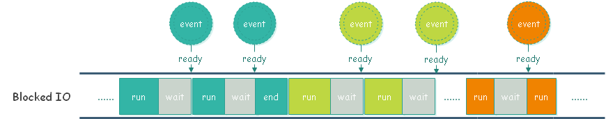
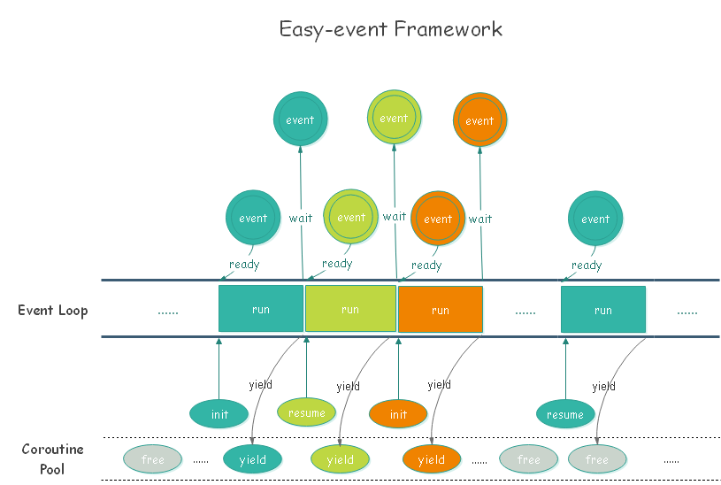

# Easy-event Framework #

## What's the problem? ##
Dealing with requests in an IO blocked way results in a long response delay time.What makes it worse is that the project is too hard to rewrite in an original way to achieve IO multiplexing like redis or nginx.

## "Easy-event Framework" solution: ##

 eframework gives you a chance to achieve IO multiplexing much more easier by using wrapped functions like ef_curl,ef_redis,ef_fastcgi and so on. These wrapped functions will work in an nonblocked way based on the coroutine and event management provided by eframework.

The eframework works in the following way:
 1. init the event management and the coroutine pool.
 2. listening on specified port which will serve the incoming requests, and add EPOLLIN event of listening socket fd to the event list;
 3. start runing in a loop, call epoll_wait to get the ready events and deal with them.
  
  >if the listening fd is ready to accept connection, choose a coroutine in the coroutine pool to start a fiber binded with specified process function;
  The point is that the process function works in an IO nonblocked way by using wrapped functions provided by eframework. These functions will add blocked IO events in the event list and yield the coroutine waiting for the event to be ready so that the coroutine will be resumed from the pool.
 
 In this case, you can program in an original way to build your application except that you should remember to use the wrapped functions in eframework instead. Thus you can enjoy the performance brought by implementing IO multiplexing without caring about the event or coroutine management.

